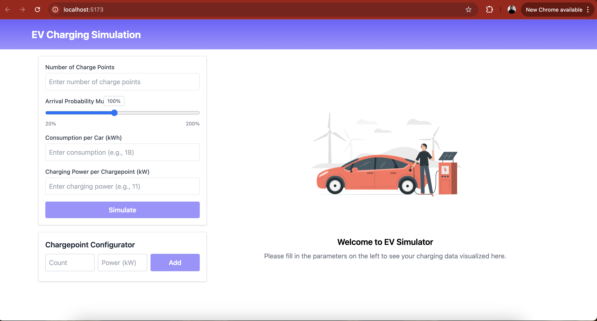

## Setup and Running the Application

### Prerequisites

- [Node.js](https://nodejs.org/) (v14 or higher)
- [npm](https://www.npmjs.com/)

### Installation

1. **Clone the Repository:**

   git clone https://github.com/sahebghosh/ev-simulation.git

2. **Change to project folder:**

   cd ev-simulation

3. **Install Dependencies:**

   npm install

4. **Running the Application**

   npm run dev

Open http://localhost:5173/ in browser.

# EV Charging Simulation Dashboard

This project is a Vite + React application that simulates electric vehicle (EV) charging behavior. Users can enter simulation parameters and visualize various metrics (e.g., charging events, energy consumption, and power demand) across different timeframes (day, week, month, year).

## Features

- **Input Form:**
  - **Number of Charge Points:** Specify how many chargepoints are available.
  - **Arrival Probability Multiplier (20–200%, default 100%):** Adjust the likelihood of EV arrivals with a dynamic slider (which shows the current value).
  - **Consumption per Car (default: 18 kWh):** Set the energy consumption for each vehicle.
  - **Charging Power per Chargepoint (default: 11 kW):** Define the charging rate.
- **Bonus Feature – Chargepoint Configurator:**
  - Create multiple types of chargepoints (e.g., 5 × 11 kW, 3 × 22 kW, 1 × 50 kW) via a dedicated UI.
- **Output Visualization:**
  - **Exemplary Day Charts:** Hourly charging events (bar chart) and power demand (line chart) for a typical day.
  - **Aggregated Charts:** Bar charts that display aggregated metrics for week, month, and year.
  - **Dynamic Summary Metrics:** Total Charging Events, Total Energy Charged (kWh), Average Charging Duration (hrs), and Peak Power Demand (kW) update dynamically based on the selected timeframe.

## Screenshots

Screenshots of the frontend are included in the `screenshots` folder:

- **Dashboard:**  
  

## Simulation Calculation Details

The calculations for the simulation are based on well-established electrical and statistical principles. Below is a breakdown of the key ideas and references:

### 1. Charging Duration Calculation

The charging duration per event is calculated using the fundamental relationship between energy, power, and time:

$$
\text{Charging Duration (hrs)} = \frac{\text{Consumption per Car (kWh)}}{\text{Charging Power per Chargepoint (kW)}}
$$

This formula is based on the principle that:

$$
\text{Energy} = \text{Power} \times \text{Time}
$$

which is widely used in electrical engineering—for example, in utility rate calculations and EV charging studies.

### 2. Estimating the Number of Charging Events

The simulation estimates the number of charging events by considering:

- A **base arrival rate** per chargepoint.
- An **arrival probability multiplier** (expressed as a percentage) to simulate increased or decreased demand.
- A **time slot factor** that varies with the hour of the day (increased during peak hours, decreased during off-peak hours).

This approach is a simplified stochastic model similar to those used in EV charging behavior studies when detailed data is unavailable.

**Reference:** Research and studies from the [National Renewable Energy Laboratory (NREL)](https://www.nrel.gov/) often apply similar probabilistic methods.

### 3. Energy and Peak Power Calculations

- **Total Energy Charged (kWh):**  
  Calculated as the total number of charging events multiplied by the consumption per car.
- **Peak Power Demand (kW):**  
  Estimated by determining the maximum number of concurrent charging sessions during the simulation period and multiplying it by the charging power per chargepoint.

These calculations are standard in load forecasting and grid impact studies for EV charging stations.

**Reference:** Academic research in IEEE and Elsevier journals on grid integration of EVs.

### 4. Aggregation for Different Timeframes

Daily simulation data is extrapolated to generate weekly, monthly, and yearly aggregates. This method assumes the daily pattern is representative and scales it over longer periods, incorporating slight random variations to simulate variability.

**Reference:** Energy simulation and load forecasting methodologies, such as those discussed in [IEA reports](https://www.iea.org/), employ similar aggregation techniques.

---

**Basic Energy Calculations:**  
The duration formula:

$$
\text{Time} = \frac{\text{Energy}}{\text{Power}}
$$

is the foundation of our charging duration calculation.

**Stochastic Modeling:**  
Using an arrival multiplier and time-of-day factors is a common technique in simulations to mimic random charging events.

**Load Forecasting:**  
Extrapolating daily values to longer periods (week, month, year) is standard practice in energy planning and forecasting.
